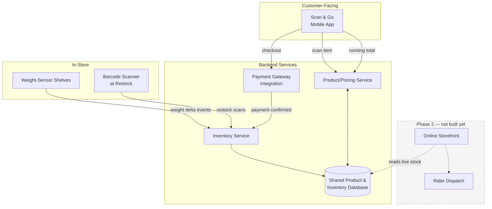
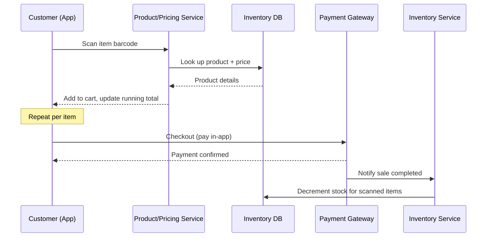

# Architecture — Phase 1 (Shelf Visibility + Scan & Go)

## System overview

## Scan & Go flow (sequence)

## Component notes

- **Weight-Sensor Shelves → Inventory Service:** each shelf reports weight-delta events; Inventory Service infers quantity change per SKU (calibrated per product weight at restock).
- **Barcode Scanner at Restock:** ground-truth correction point — restock scans confirm *which* SKU was added, compensating for the weight sensor's blind spot on product identity.
- **Shared Product/Inventory Database:** single source of truth for both Scan & Go and (later) the online storefront — this is why the data model has to be right before either feature is built (see `data-model.md`).
- **Payment Gateway:** kept as a separate integration boundary — swappable (M-Pesa, card, etc.) without touching inventory logic.
- **Phase 2 components (dashed):** included here only to show where they'll attach, not being built yet.
