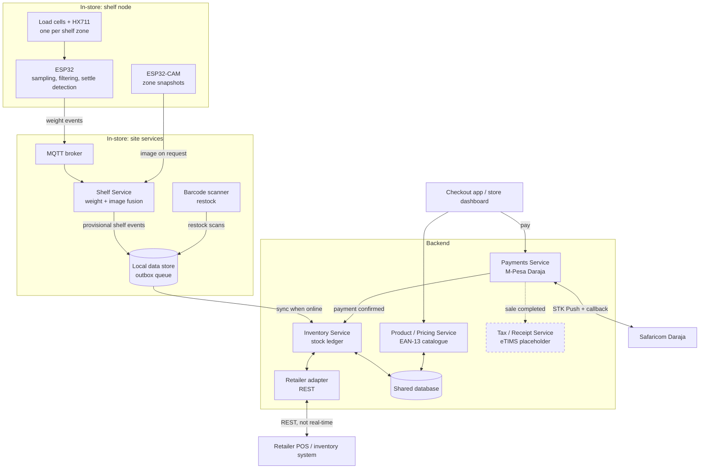
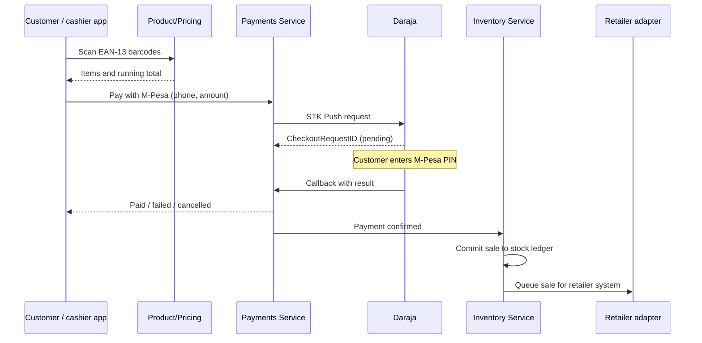
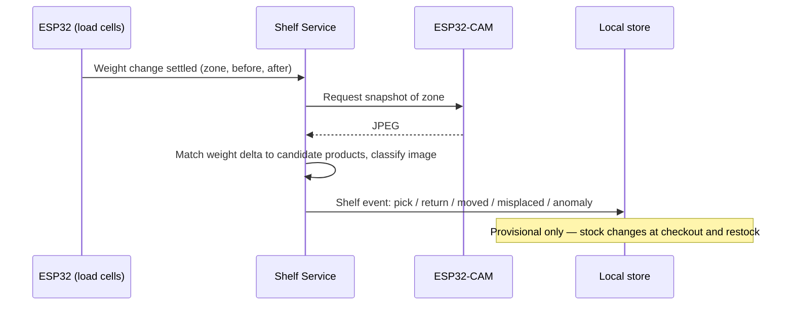

# Architecture — Phase 1

## System overview

## Checkout flow

## Shelf event flow

## Component notes

- **Shelf node:** each shelf zone sits on its own load cell. The ESP32 samples, filters and detects when the weight has changed and settled, then publishes a weight event over MQTT. It does not identify products. See [`sensor-logic.md`](sensor-logic.md).
- **ESP32-CAM:** captures a snapshot of the zone when the Shelf Service asks. Image classification runs server-side, not on the ESP32.
- **Shelf Service:** fuses the weight change with the image result into a shelf event. Runs at the site so it keeps working during internet outages.
- **Local data store:** holds shelf events, restock scans and outgoing updates in an outbox until they are confirmed delivered. Every record carries an idempotency key so retries never double-count.
- **Inventory Service:** owns the stock ledger. Stock only changes on restock, sale, or an approved adjustment.
- **Product / Pricing Service:** catalogue keyed by EAN-13 barcode, including unit weight and the label the image classifier uses.
- **Payments Service:** M-Pesa STK Push through Daraja. Card payments in Phase 2. See [`services/payments`](../services/payments).
- **Tax / Receipt Service:** placeholder. Receives completed sales and will issue eTIMS e-receipts once the integration route is confirmed. A sale is never blocked by a receipt failure.
- **Retailer adapter:** REST connection to the store's existing POS/inventory. Their systems are often slow, so sync is asynchronous. See [`reconciliation.md`](reconciliation.md).

## Deployment (POC)

- Cloud services on DigitalOcean (shared company account).
- Site services (MQTT broker, Shelf Service, local store) on one small machine in the store; for the bench prototype, a laptop.
- Daraja callbacks need a public HTTPS URL, so the Payments Service runs in the cloud.
