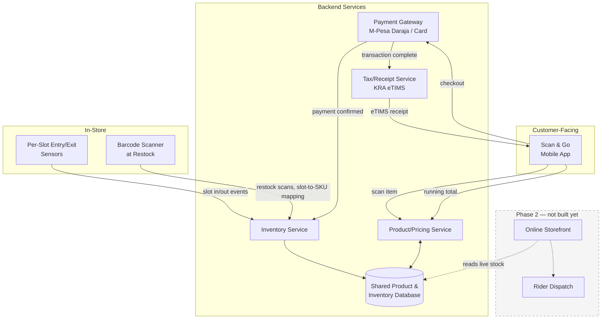
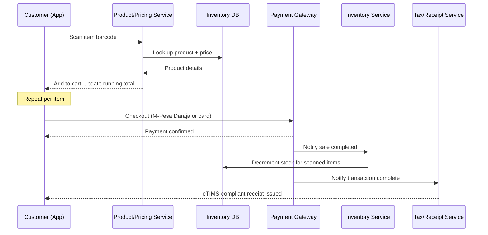

# Architecture — Phase 1 (Shelf Visibility + Scan & Go)

## System overview

## Scan & Go flow (sequence)

## Component notes

- **Per-Slot Entry/Exit Sensors → Inventory Service:** each shelf slot (one product per slot, per the data model) reports item-passed-through events via IR break-beam or time-of-flight sensing. This replaces whole-shelf weight sensing, which breaks down when a shelf mixes multiple SKUs with similar or overlapping weights — common on Kenyan supermarket shelves. Because the slot's product identity is already known (see below), the sensor only needs to count movement, not infer *what* moved.
- **Barcode Scanner at Restock:** establishes and confirms the slot-to-SKU mapping the entry/exit sensors rely on — restock scans are the ground truth for "this slot holds this product."
- **Shared Product/Inventory Database:** single source of truth for both Scan & Go and (later) the online storefront — this is why the data model has to be right before either feature is built (see `data-model.md`).
- **Payment Gateway:** kept as a separate integration boundary — M-Pesa via Daraja (STK Push) and card processing sit behind this abstraction so either can be added, swapped, or run in parallel without touching inventory logic.
- **Tax/Receipt Service:** listens for completed transactions and generates a KRA eTIMS-compliant receipt automatically. Directly extends Awesomtech's original founding concept (automated digital receipt curation for tax filing) into a live feature of Smart Shopping, not a separate product.
- **Phase 2 components (dashed):** included here only to show where they'll attach, not being built yet.
