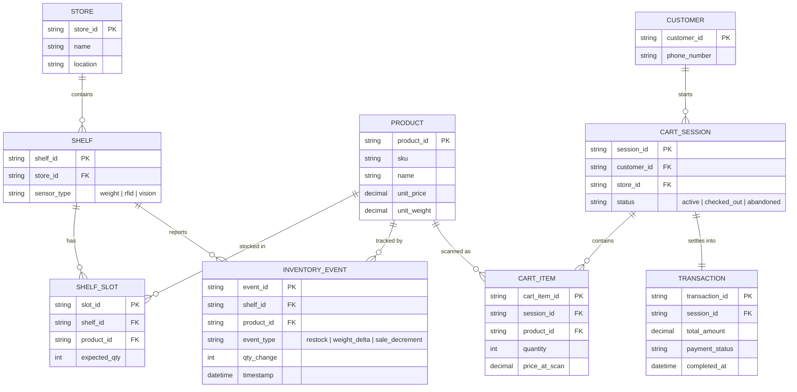

# Shared Product/Inventory Data Model

This is the single data model all Phase 1 (and later Phase 2) features sit on top of. Getting this right before writing code avoids rebuilding it once Scan & Go and online sync are layered on.

## Notes for implementation

- `INVENTORY_EVENT` is the append-only ledger every stock change flows through — both the weight-sensor and barcode-restock paths write here, and the online storefront (Phase 2) reads current stock as a rollup of this table, not a separately maintained field.
- `SHELF.sensor_type` is deliberately per-shelf, not global — lets the pilot store mix weight sensors on fast-moving items with barcode-only on others, without a schema change later.
- `price_at_scan` on `CART_ITEM` is intentional: if pricing changes mid-shop, the customer pays what they saw when they scanned.
