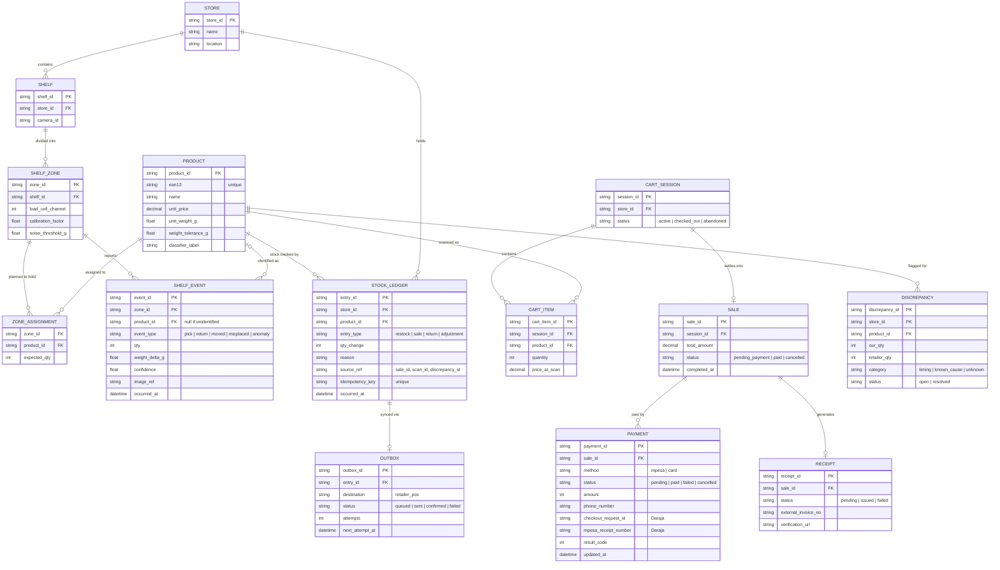

# Shared Data Model

The single data model all Phase 1 features sit on. Mirean owns the detailed sensor data points; this model sets the entities they attach to.

## Notes

- **Two kinds of stock record.** `SHELF_EVENT` is what the sensors saw (provisional, may be wrong). `STOCK_LEDGER` is committed stock, written only on restock, sale, return, or an approved adjustment. Current stock is the sum of ledger entries per product and store — never a separately edited number.
- **Weight and identity live on `PRODUCT`.** `unit_weight_g` and `weight_tolerance_g` let the Shelf Service turn a weight change into a quantity; `classifier_label` links the product to the image classifier.
- **`ZONE_ASSIGNMENT`** is the planogram: which products are meant to be in which zone. A zone can hold more than one product; the camera resolves which one moved.
- **`idempotency_key`** on ledger entries means a retried sync or a repeated callback can never count a sale twice.
- **`PAYMENT` is separate from `SALE`** so a sale can have a failed attempt followed by a successful one, and card payments slot in later without schema changes.
- **`RECEIPT`** is a placeholder for eTIMS. Fields will be finalised once the integration route is confirmed.
- **`OUTBOX` and `DISCREPANCY`** support retailer sync and reconciliation — see [`reconciliation.md`](reconciliation.md).
